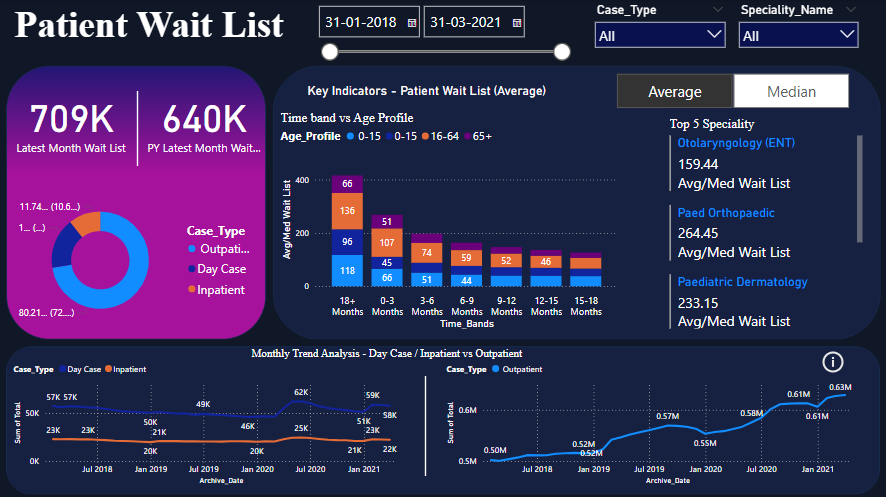
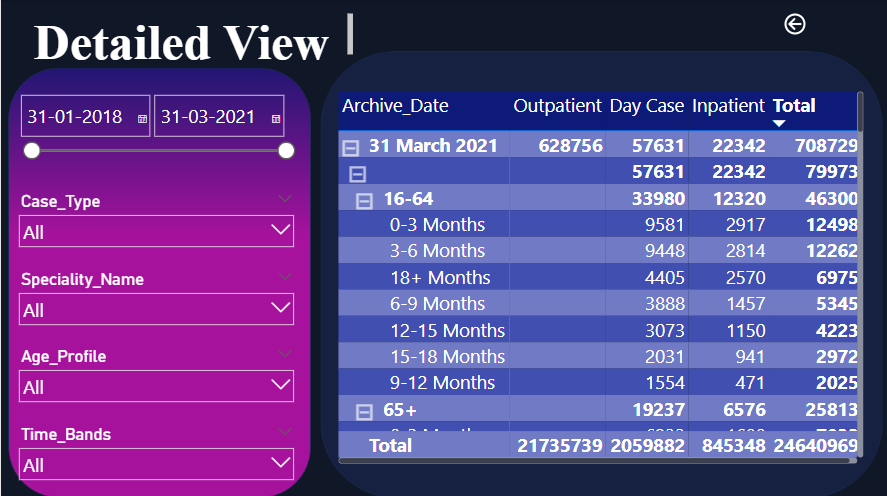

---

# Patient Wait List Analysis - Power BI Dashboard

This project is a Power BI dashboard designed to provide an interactive overview and detailed analysis of patient wait times across various case types and specialties. It is aimed at helping healthcare administrators and analysts understand patient backlog, distribution of wait times, and trends over time.

## Dashboard Features

### Summary Page

- **Total Wait List**: Visualizes the latest month’s patient wait list count compared to the same period from the previous year.
- **Case Type Distribution**: A donut chart showing the distribution of Outpatient, Day Case, and Inpatient cases.
- **Average Wait List by Age and Time Band**: Displays the average wait list for patients across different age groups (0-15, 16-64, 65+) and wait time bands (0-3 months, 3-6 months, etc.).
- **Top 5 Specialties**: Lists the top specialties by average wait time.
- **Monthly Trend Analysis**: Line chart showing the trend in wait list counts over time for each case type.

### Detailed View

- **Custom Filters**: Allows users to filter data by date, case type, specialty, age profile, and time band for more granular insights.
- **Wait List Breakdown Table**: Displays detailed wait list counts by case type (Outpatient, Day Case, Inpatient) for each time band and age group.

## How to Use
1. **Date Selection**: Use the date slider to filter data by date range.
2. **Filter Options**: Select specific case types, specialties, age profiles, and time bands to customize the view.
3. **Interactive Visualizations**: Hover over charts and data points for additional insights.

## Project Files
- **Summary_page.png**: A screenshot of the main summary page in the dashboard.
- **Detail_page.png**: A screenshot of the detailed view page.
- **powerbi_patient_wait_list.pbix**: Power BI file for the project.

## Getting Started
To explore this dashboard:
1. Download the Power BI Desktop application (if not already installed).
2. Open the `.pbix` file in Power BI Desktop.
3. Use the interactive filters and charts to explore patient wait list trends and breakdowns.

## Technologies Used
- **Power BI**: For data visualization and interactive dashboard creation.
- **Excel**: For data cleaning.

---
